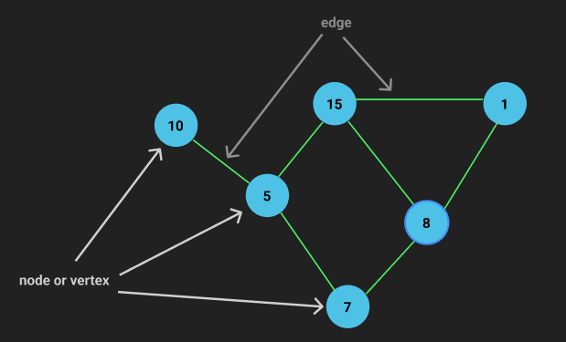
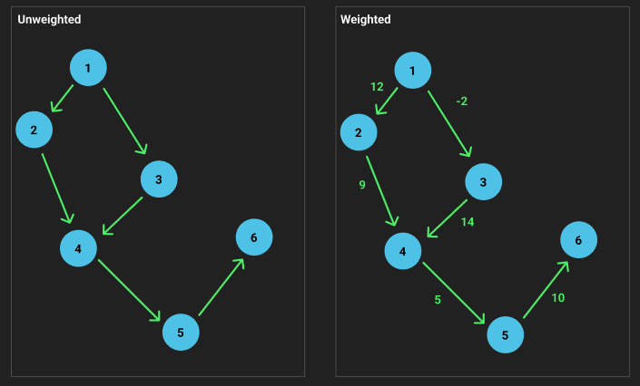
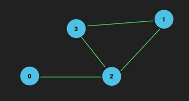

<h1>Graphs</h1>

Graphs are great data structures to model real world links relationships: WWW Networks, Social Networks, Google maps to determine the short path.

<ul>
<li><a href="https://visualgo.net/en/graphds?slide=1" >Nice site to simulate graphs</a></li>
</ul>

<h2># Characteristics</h2>
<ul>
  <li>Each item is called a <strong>Node or Vertex</strong></li>
  <li>Nodes are coneceted with <strong>Edges</strong></li>
  <li>Nodes can be Directed or Undirected</li>
  <li>Graphs can be Unweighted or Weighted</li>
  <li>Graphs can be Cyclic(vertices conneted in circle connected) or Acyclic </li>
</ul>

<h2># Graphs representations</h2>

<h3>Edge list<h3>
<pre >
const graph = [
  [0, 2], // 0 and 2 are connected
  [2, 3], // 2 and 3 are connected
  [2, 1], // 2 and 1 are connected
  [1, 3]  // 1 and 3 are connected
]
</pre>

<h3>Adjacent List<h3>
<pre >
const graph2 = [
  [2],    //index 0 is connected to 2,
  [2, 3], //index 1 is connected with 2 and 3,
  [1, 3], //index 2 is connected with 1 and 3,
  [1, 2]  //index 3 is connected with 1 and 2
]
</pre>

<h3>Adjacent Matrix<h3>
<pre >
const graph3 = {
  [0, 0, 1, 0], // index 0 has 1 connection : 2
  [0, 0, 1, 1], // index 1 has 2 connections: 2 and 3
  [1, 1, 0, 1], // index 2 has 3 connections: 0, 1 and 3
  [0, 1, 1, 0]  // index 3 has 2 connections: 1 and 2
}
</pre>
